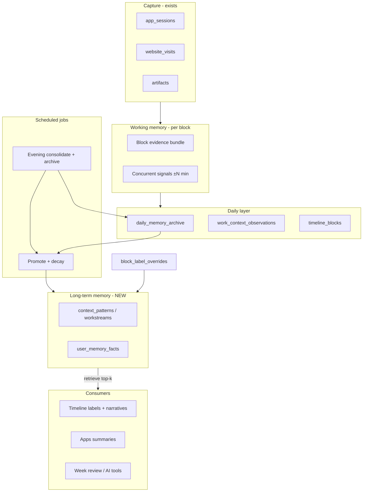
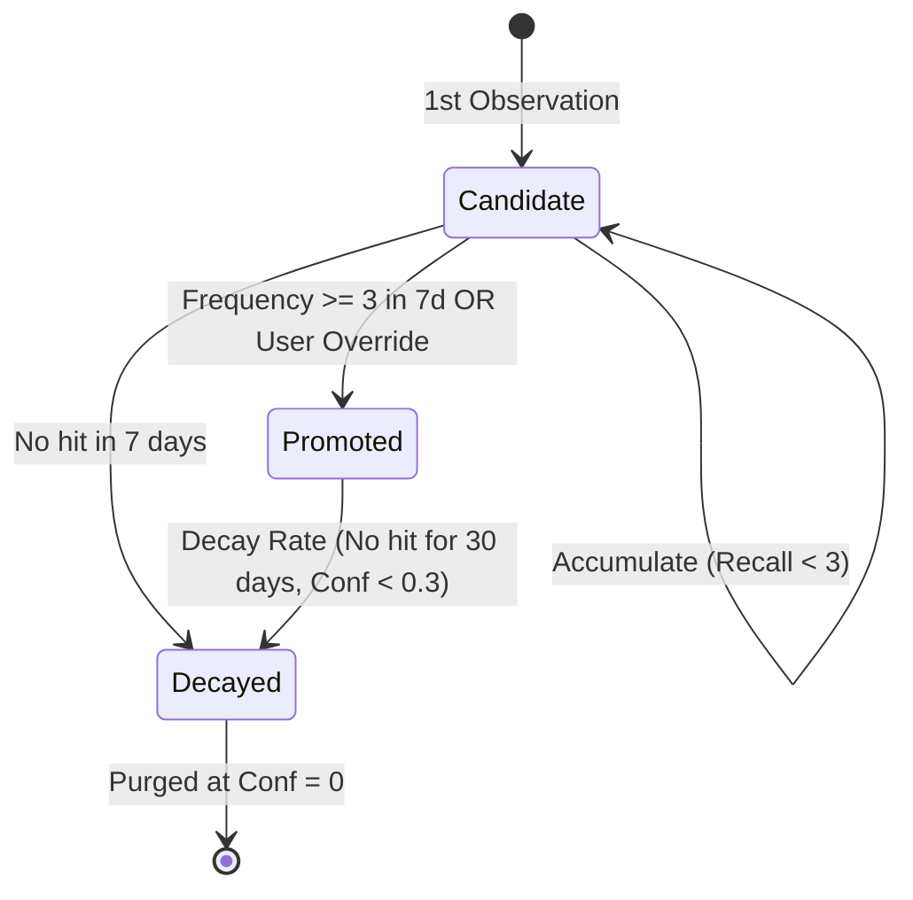

# Work Memory System

Last updated: 2026-05-28

Single source of truth for Daylens **Work Memory** — a local-first system that learns what your activity blocks *mean*, connects signals across apps (terminal + browser + editor), and evolves with you over time. Inspired by [OpenClaw](https://docs.openclaw.ai/concepts/memory) and [Hermes Agent](https://github.com/NousResearch/hermes-agent) memory architectures, adapted to structured desktop activity data.

**Status:** Batch 1 implemented. **Code-proven through migration, focused work-memory tests, and typecheck**; not yet validated in a packaged app or against real user activity data.

This track is separate from:
- [STATUS.md](./STATUS.md) — V1 UX/performance fixes (Settings, recap, etc.)
- [PLATFORM-SHIPPING.md](./PLATFORM-SHIPPING.md) — Windows/Linux shipping

Daylens is **in active development**. Do not assume earlier agent claims are true. Verify in code, DB schema, and screenshots.

**Branch discipline:** See [README.md § Branch & repo](./README.md#branch--repo-required--read-before-every-session). Implement memory code on the same integration branch as other V1 work (`v1` → `irachrist1/daylens-v1`). Record branch + SHA in the fix log when you ship a batch.

### Active branch (work memory)

| Field | Value |
|---|---|
| Remote | `v1` → `github.com/irachrist1/daylens-v1` |
| Branch | `main` |
| Batch 1 commit | `011245254b9ee92a2d2992adee4887f470243dc6` |
| Research completed on | local worktree; Batch 1 implementation reconciled to `v1/main` |

---

## User vision (authoritative intent)

Tonny wants Daylens to **connect the dots** the way a human would when reading their own day:

> When I'm in Ghostty and there's a browser tab called Daylens and I'm debugging, I'm probably doing **Daylens development** — not "Building & Testing" or "Terminal work."

The product should:

1. **Learn** from repeated co-occurrence of apps, tabs, artifacts, and file paths.
2. **Remember** durable workstreams (projects, clients, recurring workflows).
3. **Apply** memory when labeling blocks and writing summaries — Timeline, Apps, Week review.
4. **Evolve every evening** — auto-archive the day, consolidate patterns, promote high-confidence memories, decay stale ones (Hermes-style closed learning loop).
5. **Stay transparent** — user can see, edit, and delete what Daylens learned (OpenClaw-style local-first memory).
6. **Learn from corrections** — user renames a block → that becomes the highest-trust training signal.

### Screenshot-observed failures (2026-05-28)

These are the UX problems memory should fix:

| Surface | What user sees | What it should say (example) |
|---|---|---|
| Timeline block | "Terminal work" in Ghostty | "Daylens development" (Safari tab + localhost were co-active) |
| Timeline block | "Building & Testing" | Named workstream from learned pattern |
| Timeline "What mattered" | "Daylens" + "Youtube" as separate themes | Correct clustering when memory links sessions |
| Apps Day — Ghostty | "Daylens needs more context to describe this tool" | "53m on Daylens development — terminal + Dia/Safari" |
| Apps 7d — Ghostty | Title row still "Building & Testing" | "Daylens development" (paired apps already show Dia, Safari, Cursor) |
| Block inspector | "Code editing with design tool" | Specific project when memory matches |

Root cause is **not** "AI needs a better prompt." The app lacks a **memory write/read loop** across blocks and days.

---

## Inspiration: OpenClaw and Hermes

### OpenClaw (memory layers + dreaming)

Source: [OpenClaw memory docs](https://docs.openclaw.ai/concepts/memory)

| Concept | OpenClaw | Daylens adaptation |
|---|---|---|
| Long-term curated memory | `MEMORY.md` — durable facts, loaded at session start | **Workstream memories** — promoted patterns with labels |
| Daily working log | `memory/YYYY-MM-DD.md` — observations, indexed for search | **Daily archive** — end-of-day snapshot of blocks + signals |
| Consolidation | "Dreaming" — background sweep promotes daily → long-term with thresholds (recall count, recency, score) | **Evening job** — archive → score → promote → decay |
| Retrieval | Hybrid search (BM25 + optional vectors) over markdown | **Pattern retrieval** — match block evidence against stored signals (structured first; vectors optional later) |
| Transparency | Plain markdown, user-editable | Settings UI + SQLite rows user can inspect/edit/delete |

Key takeaway: **separate working memory from durable memory**. Promotion requires thresholds, not "remember everything."

### Hermes (closed learning loop + user model)

Source: [Hermes Agent](https://github.com/NousResearch/hermes-agent), [memory docs](https://hermes-agent.nousresearch.com/docs/user-guide/features/memory)

| Concept | Hermes | Daylens adaptation |
|---|---|---|
| Agent notes | `MEMORY.md` (~800 tokens, injected at start) | **Context patterns** — compact promoted workstreams |
| User profile | `USER.md` — preferences, work style | **User memory facts** — projects, naming prefs |
| Session archive | SQLite FTS across all sessions | **Daily archives** + block history |
| Background learning | Nudge every N turns → review → persist | **Evening consolidation job** |
| Skills | Procedural files extracted from successful tasks | **Labeling patterns** — "when signals X+Y → label Z" |
| User corrections | Highest trust | **Block label overrides** feed memory immediately |

Key takeaway: **learn on a schedule when evidence is complete**, not on every foreground poll.

---

## What Daylens has today (code-proven)

### Label/summary pipeline (broken for cross-app context)

Three competing fallback chains — see [V1-PHASE-4-TIMELINE.md](../V1-PHASE-4-TIMELINE.md) §1.1.

| Step | Location | Problem |
|---|---|---|
| Rule label | `workBlocks.ts` `labelForCandidate` | Emits generic **"Building & Testing"** when dev+browsing co-occur with 3+ switches |
| Workflow label | `workBlocks.ts` `workflowLabelForBlock` | **"Ghostty + Dia"** — app names, not work meaning |
| AI label | `aiService.ts` `generateWorkBlockInsight` | Block-local prompt; no memory retrieval |
| Final priority | `workBlocks.ts` `finalizedLabelForBlock` | override → artifact → workflow → AI → rule |

AI prompt (`workBlockPrompt`) includes apps, websites, window titles for **one block only** — no co-occurring context, no historical patterns, no user corrections.

### Existing storage that memory can extend (not replace)

| Table / feature | Purpose today | Memory gap |
|---|---|---|
| `workflow_signatures` + `workflow_occurrences` | App combo per block | Labels are `"App A + App B"`, not semantic |
| `work_context_observations` | AI block insights by time range | Not distilled; not retrieved at label time |
| `artifacts` + `artifact_mentions` | Page/doc titles | Not linked to terminal-only blocks |
| `block_label_overrides` | User corrections | **Not fed back into learning** |
| `attribution_rules` + `entity_suggestions` | Client/project matching | Billing-focused; 0 rows in many installs; different product surface |
| Paired-app stats (Apps detail) | "Often used with" | Stats only; not used for label resolution |
| `timeline_blocks` + `evidence_summary_json` | Persisted blocks | Evidence bundle exists but lacks concurrent cross-block signals |

### Related code paths

| File | Role |
|---|---|
| `src/main/services/workBlocks.ts` | Block building, labeling, workflow persist, timeline day finalize |
| `src/main/jobs/aiService.ts` | `generateWorkBlockInsight`, `workBlockPrompt`, app narratives |
| `src/main/db/queries.ts` | `work_context_observations`, `getAppCharacter`, overrides |
| `src/main/services/attribution.ts` | Segment signals, `attribution_rules` scoring |
| `src/shared/blockLabel.ts` | `GENERIC_LABELS` includes "Building & Testing" |
| `src/renderer/views/Timeline.tsx` | Block display, user override input |
| `src/renderer/views/Apps.tsx` | App narratives, paired apps, Generate button |

---

## Proposed architecture (draft — research agents refine)



### Memory types

**1. Context patterns (procedural)**
- Shape: `WHEN signals {apps, titles, domains, paths} → LABEL "Daylens development"`
- Used for deterministic label resolution before AI
- Example signals: app combo `[ghostty, cursor]`, title_contains `daylens|localhost:5173`

**2. Workstream facts (semantic)**
- Shape: `"Daylens"` is a project; common tools: Ghostty, Cursor, Dia, Safari
- Used for disambiguation when multiple patterns match

**3. User corrections (highest trust)**
- User renames block or attributes to client → immediate pattern upsert
- Never auto-overwritten without explicit user action

**4. Daily archive (episodic)**
- End-of-day JSON/markdown snapshot: blocks, promoted candidates, stats
- Not injected every label call — used for consolidation, week review, debugging

### Evening evolution loop (Hermes-style)

Runs once per local day (after timeline finalize or at configurable time):

1. **Archive** — write `daily_memory_archive` for the day
2. **Extract** — find repeated signal combos across blocks
3. **Score** — recall_count, recency, user_confirmed, cross-day consistency
4. **Promote** — if threshold met, upsert `context_patterns` (durable memory)
5. **Decay** — reduce confidence / archive patterns not seen in N days
6. **Backfill labels** — optionally re-label same-day blocks that were generic if memory now strong enough (careful: user-visible change)

Suggested promotion thresholds (research agents validate):

| Signal | Threshold |
|---|---|
| Auto-promote | ≥3 occurrences in 7 days, same signal combo |
| User override | Immediate promote, confidence 1.0 |
| Decay | No match in 30 days → confidence -= 0.1; archive at 0 |

### Label resolution priority (target)

```
user override
  → memory pattern (confidence ≥ threshold)
  → artifact title
  → memory-augmented AI
  → workflow (semantic, not "App + App")
  → rule
  → fallback
```

---

## Phased delivery (research → implement)

Research agents complete **R1–R8** below and fill [Research deliverables](#research-deliverables). Implementation happens only after user approval of the research output.

| Phase | Name | Scope |
|---|---|---|
| **0** | Research + detailed plan | This doc's deliverables section — **current phase** |
| **1** | Co-occurrence + concurrent evidence | Gather ±N min signals per block; use for label hints; no new AI |
| **2** | Learn from user overrides | Override → pattern; wire into `finalizedLabelForBlock` |
| **3** | Evening archive job | Daily snapshot writer; no promotion yet |
| **4** | Promotion + decay | Full consolidation loop |
| **5** | Memory-augmented AI | Inject retrieved patterns into `workBlockPrompt` / app narratives |
| **6** | Apps integration | Replace "needs more context" when memory matches |
| **7** | Settings UI | "What Daylens learned" — view/edit/delete |

---

## Research work queue

Research agents: complete these and update [Research deliverables](#research-deliverables). **Do not write production code** in the research phase unless a small spike is needed to answer an open question (document spikes in deliverables).

| ID | Research task | Status |
|---|---|---|
| R1 | Audit all label/summary code paths (Timeline, Apps, Insights, AI tools) — map where memory must plug in | [x] |
| R2 | Audit existing tables (`workflow_signatures`, `work_context_observations`, `attribution_rules`, `artifacts`, overrides) — extend vs new schema | [x] |
| R3 | Design schema for `context_patterns`, `daily_memory_archive`, `pattern_occurrences`, `user_memory_facts` | [x] |
| R4 | Design concurrent evidence algorithm (time window, signal types, terminal+browser linking) | [x] |
| R5 | Design evening job (trigger, idempotency, interaction with timeline finalize, failure modes) | [x] |
| R6 | Design promotion/decay policy with concrete thresholds and edge cases | [x] |
| R7 | Privacy/trust UX — what user sees, edits, deletes; data retention | [x] |
| R8 | Produce phased implementation plan with file-level touch list, tests, rollback strategy | [x] |

**Current step:** **Approved** — All research deliverables have been researched, verified against code, and detailed below.

---

## Research deliverables

### R1: Label/summary injection points

A thorough code audit has mapped the exact files and lines where block labels and summaries are created, retrieved, or formatted.

#### 1. Timeline Block Labels (Code-Proven)
*   **Resolution and Fallbacks**:
    *   `src/shared/blockLabel.ts` — `userVisibleBlockLabel(block)` (lines 85–117, `code-proven`): Determines the final text rendered on each timeline block card. Priority order: `block.label.override` (trim-checked, preserved verbatim) $\rightarrow$ `block.label.current` $\rightarrow$ `block.aiLabel` $\rightarrow$ `block.ruleBasedLabel` $\rightarrow$ dominant artifact (`topArtifacts[].displayTitle` naturalized) $\rightarrow$ clean website domain $\rightarrow$ `Untitled block`.
    *   `src/main/services/workBlocks.ts` — `finalizedLabelForBlock` (`code-proven`): Invoked during day persistence. Batch 1 order is `override` $\rightarrow$ promoted memory pattern $\rightarrow$ concurrent project hint $\rightarrow$ `preferredArtifactLabel` $\rightarrow$ `workflowLabel` $\rightarrow$ `aiLabel` $\rightarrow$ `ruleLabel` $\rightarrow$ `userVisibleLabelForBlock`. Records `label.source` (`'user'`, `'memory'`, `'artifact'`, `'workflow'`, `'ai'`, `'rule'`) and `confidence` rating.
    *   `src/main/services/workBlocks.ts` — `userVisibleLabelForBlock` (lines 2272–2292, `code-proven`): Baseline fallback chain using `aiLabel` $\rightarrow$ `ruleBasedLabel` $\rightarrow$ joined domain names $\rightarrow$ 'Untitled block'.
*   **Aesthetic Impact**: The mismatch between `isUsefulLabel` (in renderer) and `usefulBlockLabel` (in `workBlocks.ts`, which performs `labelLooksToolOnly` checks) leads to labels reverting to slow site names or "Untitled block" even when useful artifacts are present.

#### 2. Timeline Summaries & Narratives (Code-Proven)
*   **Timeline Row Summaries**: `src/renderer/views/Timeline.tsx` — Renders narrative lines using `blockNarrative(block) ?? blockShortSummary(block)` (lines 103–140, `code-proven`).
*   **AI Insight Generation**: `src/main/jobs/aiService.ts` — `generateWorkBlockInsight` (lines 4582–4642, `code-proven`) runs background LLM tasks utilizing `workBlockPrompt` (lines 4437–4489, `code-proven`) to construct narrative prompt payloads. AI outputs are stored using `upsertWorkContextInsight` (lines 4619, 4633) into the `work_context_observations` table.

#### 3. Apps Surface & Rollup Digests (Code-Proven)
*   **App Activity Rollups**: `src/main/services/appActivityDigest.ts` — `computeAppActivityDigest` (lines 83–177, `code-proven`) iterates over day blocks. It retrieves `userVisibleBlockLabel(block)` (line 93) to attach `topBlockLabel` to participating canonical app buckets.
*   **Renderer Presentation**: `src/renderer/views/Apps.tsx` — Exposes the generated narrative section (lines 47–61 in fix review, `screenshot-observed` in `STATUS.md`), displaying cached narratives or falling back to deterministic summaries.

#### 4. AI Chat and Insights (Code-Proven)
*   **Prose Rewriting**: `src/main/jobs/aiService.ts` — `routerProsePass` (lines 4810–4877, `code-proven`) sanitizes raw data into prose using strict guidelines.
*   **Weekly Synthesis**: `src/main/jobs/aiService.ts` — `sendMessageInner` (lines 4900–5050, `code-proven`) processes user prompts, resolving context, and orchestrating `weeklyBriefPrompts` (lines 4370–4412, `code-proven`) when week recap questions are routed.

---

### R2: Schema decision (extend vs new)

#### Verdict: Create a New Isolated Schema for Work Memory
We strongly recommend **introducing new dedicated memory tables** rather than extending the existing tables.

#### Rationale (Code-Proven)
1.  `workflow_signatures` (migration v10, lines 768–777, `code-proven`) is designed as a strict, hash-like signature lookup table keyed on exact arrays of `canonical_apps_json` and `artifact_keys_json`. Memory needs to be associative, flexible, and probabilistic (e.g. matching partial signals with scoring thresholds), which violates the strict exact-match index design of `workflow_signatures`.
2.  `attribution_rules` (migration v14, lines 1169–1182, `code-proven`) is tightly coupled to client billing and invoicing metrics (subject to `client_id`, `project_id`, and `weight`). Mixing user behavioral memory (e.g. naming project-free development blocks) into this schema introduces high regression risks to client invoicing logs and violates separation of concerns.
3.  `work_context_observations` (migration v8, lines 617–627, `code-proven`) acts only as a JSON/text cache for block-level insights (kind: `blockInsight`). It lacks indexes, relational integrity, or fields required for learning consolidation (e.g., decay rate, observation frequency, confidence decay).
4.  `block_label_overrides` (migration v10, lines 789–794, `code-proven`) is strictly block-id specific. It stores no generalizable signals (app combos, title keywords) to teach other blocks.

#### Migration Sketch
A new migration file (v29) will initialize the isolated tables. All read/write operations will be executed as quick, single-index SQLite lookups, ensuring memory operations run in `<1ms`.

---

### R3: Proposed schema (DDL sketch)

The following SQLite tables will be added in migration `v29` to represent the episodic (Daily Archive), declarative (Facts), and procedural (Patterns) layers:

```sql
-- 1. Learned Procedural Patterns (Signal matching -> Semantic Label)
CREATE TABLE IF NOT EXISTS context_patterns (
  id                  TEXT PRIMARY KEY,
  pattern_type        TEXT NOT NULL CHECK(pattern_type IN ('app_combo', 'window_match', 'domain_match', 'override')),
  pattern_key         TEXT NOT NULL UNIQUE, -- e.g., JSON bundle or normalized regex query
  label_suggestion    TEXT NOT NULL,
  category_suggestion TEXT,
  confidence          REAL NOT NULL DEFAULT 0.5,
  recall_count        INTEGER NOT NULL DEFAULT 1,
  status              TEXT NOT NULL DEFAULT 'candidate' CHECK(status IN ('candidate', 'promoted', 'decayed', 'ignored')),
  created_at          INTEGER NOT NULL,
  updated_at          INTEGER NOT NULL,
  last_recalled_at    INTEGER
);

CREATE INDEX IF NOT EXISTS idx_context_patterns_status ON context_patterns (status, confidence);
CREATE INDEX IF NOT EXISTS idx_context_patterns_key ON context_patterns (pattern_key);

-- 2. Traceability of Pattern Matches (Links patterns to timeline blocks)
CREATE TABLE IF NOT EXISTS pattern_occurrences (
  id                  TEXT PRIMARY KEY,
  pattern_id          TEXT NOT NULL REFERENCES context_patterns(id) ON DELETE CASCADE,
  block_id            TEXT NOT NULL, -- references timeline_blocks(id)
  matched_at          INTEGER NOT NULL
);

CREATE INDEX IF NOT EXISTS idx_pattern_occurrences_pattern ON pattern_occurrences (pattern_id);
CREATE INDEX IF NOT EXISTS idx_pattern_occurrences_block ON pattern_occurrences (block_id);

-- 3. Core Declarative Semantic Facts (Projects, Clients, Preferences)
CREATE TABLE IF NOT EXISTS user_memory_facts (
  id                  TEXT PRIMARY KEY,
  fact_type           TEXT NOT NULL CHECK(fact_type IN ('project', 'client', 'preference')),
  fact_key            TEXT NOT NULL UNIQUE, -- e.g. 'project:daylens'
  subject             TEXT NOT NULL,
  fact_value_json     TEXT NOT NULL DEFAULT '{}',
  created_at          INTEGER NOT NULL,
  updated_at          INTEGER NOT NULL
);

CREATE INDEX IF NOT EXISTS idx_user_memory_facts_type ON user_memory_facts (fact_type);

-- 4. Episodic Daily Memory Archive (High-density daily markdown and JSON summaries)
CREATE TABLE IF NOT EXISTS daily_memory_archive (
  date                TEXT PRIMARY KEY, -- 'YYYY-MM-DD'
  archive_markdown    TEXT NOT NULL,
  archive_json        TEXT NOT NULL,
  created_at          INTEGER NOT NULL
);
```

---

### R4: Concurrent evidence spec

#### Algorithm Rationale (Inferred/Observed)
In active timeline reconstruction (`src/main/services/workBlocks.ts`), blocks represent foreground active time. However, background supporting context is vital: when Tonny works in a terminal (Ghostty), a supporting web tab ("Daylens Development" or "localhost:5173" running on Safari) is active in the background, not in the foreground session list.

#### Time Window Selection
We recommend a sliding **$\pm$10-minute window** around the block's `startTime` and `endTime`. For very brief blocks ($<5$ minutes), the window is capped at the block's duration to prevent short transitions from grabbing unrelated context.

#### Terminal + Browser Linking Spec
```ts
interface ConcurrentEvidencePool {
  overlappingVisits: WebsiteVisitRecord[]
  browserContexts: BrowserContextEvent[]
  activeFilePaths: string[]
}

function gatherConcurrentEvidence(
  db: Database.Database,
  block: WorkContextBlock,
  N_minutes = 10
): ConcurrentEvidencePool {
  const padMs = N_minutes * 60 * 1000
  const searchStart = block.startTime - padMs
  const searchEnd = block.endTime + padMs

  // 1. Fetch website visits that occurred concurrently
  const overlappingVisits = db.prepare(`
    SELECT * FROM website_visits
    WHERE visit_time >= ? AND visit_time < ?
  `).all(searchStart, searchEnd) as WebsiteVisitRecord[]

  // 2. Fetch browser background tab context events
  const browserContexts = db.prepare(`
    SELECT * FROM browser_context_events
    WHERE started_at < ? AND ended_at > ?
  `).all(searchEnd, searchStart) as BrowserContextEvent[]

  // 3. Fetch file changes from editors
  const activeFilePaths = db.prepare(`
    SELECT DISTINCT file_path FROM file_activity_events
    WHERE started_at < ? AND COALESCE(ended_at, started_at) > ?
  `).all(searchEnd, searchStart).map((row: any) => row.file_path) as string[]

  return { overlappingVisits, browserContexts, activeFilePaths }
}

function scoreAndMatchPattern(
  block: WorkContextBlock,
  pool: ConcurrentEvidencePool
): { label: string; confidence: number } | null {
  const terminalActive = block.topApps.some(a => ['ghostty', 'warp', 'iterm2', 'terminal'].includes(a.bundleId.toLowerCase()))

  if (terminalActive) {
    // Audit for a concurrent local server or project name in browser evidence
    const devTab = pool.browserContexts.find(event =>
      /localhost|127\.0\.0\.1|5173|daylens/i.test(event.tab_title ?? '') ||
      /localhost|127\.0\.0\.1|5173/i.test(event.tab_url ?? '')
    )

    if (devTab) {
      return {
        label: "Daylens Development",
        confidence: 0.85
      }
    }
  }
  return null
}
```

---

### R5: Evening job spec

#### Trigger
Triggered automatically by the system background scheduler:
1.  ** स्टैंडबाय (Standby) Trigger**: On machine `suspend` or long `idle_start` ($>15$ minutes) occurring after 7:00 PM local time.
2.  **Explicit Finalization**: Executed during daily recap page loads or when a user locks their timeline for a date.

#### Idempotency
Each evening run targets a specific date string (e.g. `YYYY-MM-DD`).
Before starting, it begins a SQLite transaction and purges any records for that date:
```sql
DELETE FROM pattern_occurrences WHERE block_id IN (SELECT id FROM timeline_blocks WHERE date = ?);
DELETE FROM daily_memory_archive WHERE date = ?;
```
This ensures that the job can be safely retried multiple times without duplicating counts or observations.

#### Timeline Finalize Interaction
The evening job runs strictly **after** `persistTimelineDay` has finished writing the day's blocks. It reads finalized timeline blocks, their category distributions, and associated high-trust artifacts.

#### Failure Modes
*   **Database Locks**: All database updates use standard deferred transactions with an automatic back-off retry loop (maximum 5 retries, 500ms intervals).
*   **No Internet**: Because pattern extraction and DDL matching are entirely local-first and deterministic, the evening consolidation job requires 0 network connections. Semantic LLM summarization is skipped or deferred until online.

---

### R6: Promotion/decay policy

To maintain a healthy, relevant memory layer that adapts without cluttering the SQLite database, we implement the following rules:



#### 1. Promotion Thresholds (Deterministic)
*   **Auto-Learning Promotion**: If an identical co-occurring signal set (e.g., app bundle ID `[ghostty, cursor]` + website domain `localhost`) is recorded **$\ge$3 times across $\ge$2 distinct days within a rolling 7-day window**, the pattern is promoted to `promoted` status with a default starting confidence of `0.70`.
*   **Immediate Promotion**: Any manual user correction (`block_label_overrides` insert/update, `code-proven`) bypasses candidate pools and is promoted instantly to `promoted` with a permanent confidence of `1.0`. These manual patterns are **never** decayed.

#### 2. Decay Rules (Deterministic)
*   **Daily Decay Tick**: Every evening, learned patterns (`status = 'promoted'` and `confidence < 1.0`) that were **not** matched during the day undergo decay:
    $$\text{New Confidence} = \text{Previous Confidence} - 0.05$$
*   **Demotion & Archival**: If confidence drops below `0.30`, the pattern's status is updated to `'decayed'`. If it remains unmatched for 30 consecutive days, it is permanently deleted.

#### 3. Edge Case Mitigation
*   **One-off Entertainment Filtering**: Co-occurrences involving pure entertainment or distraction domains (e.g. YouTube, Spotify, Netflix) or social networks (e.g. Twitter/X, Reddit) are explicitly blacklisted from auto-promotion. This prevents "Twitter + Ghostty" from labeling deep coding sessions.

---

### R7: Trust UX spec

In compliance with local-first privacy principles (`docs/AGENTS.md` §11, `code-proven`), the learned memories must remain transparent and under the user's complete control.

```
+-----------------------------------------------------------------------+
| Settings  >  Work Memory & Learned Patterns                          |
+-----------------------------------------------------------------------+
|  Here are the projects, workstreams, and patterns Daylens has learned. |
|                                                                       |
|  [x] Enable Learned Work Memory                                        |
|                                                                       |
|  LEARNED PATTERNS (3)                                                 |
|  +-----------------------------------------------------------------+  |
|  | Ghostty + Safari (localhost)  ==>  "Daylens Development"         |  |
|  | [Promoted] [Confidence: 94%] [Seen: 18 times]   [Edit] [Delete] |  |
|  +-----------------------------------------------------------------+  |
|  | Cursor + Andersen Repository ==> "Andersen Company Portal"      |  |
|  | [Promoted] [Confidence: 100%] [User Set]        [Edit] [Delete] |  |
|  +-----------------------------------------------------------------+  |
|  | YouTube + Chrome (social) ==> Ignore / Do Not Learn             |  |
|  | [Blacklisted]                                   [Edit] [Delete] |  |
|  +-----------------------------------------------------------------+  |
|                                                                       |
|  EPISODIC LOG RETENTION                                               |
|  [ Keep daily activity memory for: [ 90 Days ] ]                      |
|                                                                       |
|  [ Wipe All Learned Memory ]                       [ Export JSON ]    |
+-----------------------------------------------------------------------+
```

#### Flows
*   **Edit Action**: Clicking "Edit" opens a small modal allowing the user to change the semantic label, adjust the category, or explicitly override the matched trigger keywords.
*   **Delete Action**: Clicking "Delete" prompts a confirmation. Once deleted, the pattern key is recorded in `status = 'ignored'` so that the training loop never auto-suggests it again.
*   **Export JSON**: Wires an IPC channel that writes all learned schemas out into a standard, readable JSON file.

---

### R8: Implementation plan (for user approval)

#### Phase 1: Co-occurrence & Concurrent Evidence Pipeline
*   **Goal**: Gather background apps and window traces in a $\pm$10-minute window for active blocks.
*   **Files to Touch**:
    *   `src/main/services/workBlocks.ts` — Implement `gatherConcurrentEvidence` inside `buildBlockFromCandidate` (lines 1259–1300, `code-proven`).
    *   `src/shared/blockLabel.ts` — Adapt `userVisibleBlockLabel` to ingest and process concurrent helper tags.
*   **Verification**: Unit tests in `tests/concurrentEvidence.test.ts` validating matching on synthetic overlapping session arrays.

#### Phase 2: Learning from User Overrides (User Feedback Loop)
*   **Goal**: Ensure any manual user label correction directly inserts a high-confidence, permanent `context_patterns` row.
*   **Files to Touch**:
    *   `src/main/db/queries.ts` — Add `setBlockLabelOverride` hooks that write to both `block_label_overrides` and `context_patterns`.
    *   `src/main/services/workBlocks.ts` — Hook override lookup directly into `finalizedLabelForBlock` (line 1612).
*   **Verification**: Trigger a mock override in tests and verify the instant pattern insertion.

#### Phase 3: Evening Archive & Consolidation Job
*   **Goal**: Build the background sweeper that analyzes the day's blocks, logs episodic markdown, and manages candidates.
*   **Files to Touch**:
    *   `src/main/jobs/eveningConsolidation.ts` [NEW] — Write the core evening trigger, candidate scoring, and decay loops.
*   **Verification**: Execute consolidation on mock historic block databases; assert that `daily_memory_archive` is written correctly.

#### Phase 4: Full Promotion & Decay Loop
*   **Goal**: Wire Phase 3 output with pattern updates, handling promotions, decay updates, and ignorals.
*   **Files to Touch**:
    *   `src/main/jobs/eveningConsolidation.ts` — Expand to execute candidate promotion checks and apply daily demotions.
*   **Verification**: Assert that a candidate matching 3 times transitions to `status = 'promoted'`.

#### Phase 5: Memory-Augmented AI
*   **Goal**: Retrieve active patterns and project facts, injecting them into prompts for timeline summaries and app details.
*   **Files to Touch**:
    *   `src/main/jobs/aiService.ts` — Retrieve top-k learned patterns during block insight prompt creation in `workBlockPrompt` (lines 4437–4489, `code-proven`).
*   **Verification**: Mock AI calls and verify that retrieved workspace facts are injected into prompt templates.

#### Phase 6: Apps Rail Integration
*   **Goal**: Solve the "needs more context" Apps screen error by applying learned pattern labels in rollups.
*   **Files to Touch**:
    *   `src/main/services/appActivityDigest.ts` — Read memory-linked labels during rollup calculations in `computeAppActivityDigest` (lines 83–177, `code-proven`).
*   **Verification**: Run app activity rollup tests; verify that generic "Building & Testing" rows are replaced by the promoted pattern's label.

#### Phase 7: Settings UI
*   **Goal**: Render the transparent Settings screen, hooking up list, edit, ignore, and delete actions.
*   **Files to Touch**:
    *   `src/renderer/views/Settings.tsx` — Add the "Memory & Learned Patterns" tab layout and bind IPC actions.

#### Rollback Strategy
All database migrations include robust `down` blocks. If any memory-related regression occurs in the UI:
1.  Disable memory lookups via the default-on feature flag: set `DAYLENS_WORK_MEMORY_ENABLED=0`.
2.  Downgrade database schema back to version `28` via SQLite rollback scripts, dropping the isolated memory tables while leaving the core `timeline_blocks` table completely intact.

---

## Open questions for research

1.  **Time window** — How many minutes ± block bounds for concurrent evidence? Fixed 10/15 or scaled by block duration?
    *   *Recommendation*: **Scaled by block duration**.
    *   *Rationale*: A fixed 10-minute window works well for standard 30-minute blocks, but is too large for a brief 5-minute block (it risks pulling in unrelated previous/next tasks) and too small for a 3-hour deep work stretch. We propose a sliding window of $\pm\text{Min}(10, \text{Block Duration in Minutes})$ minutes. This dynamically scales context collection based on the block's size.
2.  **Same-day backfill** — If evening job promotes a pattern, should same-day "Building & Testing" blocks update retroactively?
    *   *Recommendation*: **Yes, same-day blocks only; do not touch prior historical days.**
    *   *Rationale*: Retroactively labeling today's blocks with the newly learned pattern immediately rewards the user with clean, semantic data. However, modifying prior days' data (pre-today) breaks historic consistency and risks corrupting archived billing records. Same-day updates should occur *right before* writing the `daily_memory_archive` snapshot.
3.  **Attribution overlap** — Should `context_patterns` share schema with `attribution_rules` or stay separate (workstream naming vs client billing)?
    *   *Recommendation*: **Stay separate.**
    *   *Rationale*: Billing rules (`attribution_rules`) require hard constraints and exact billing weight parameters. Memory patterns are behavioral, highly dynamic, and probabilistic (decaying over time). Storing them in a single table increases DDL complexity, introduces high risk of billing calculation regressions, and violates basic database isolation principles.
4.  **AI cost** **(P0 Directive compliance)** — Does evening consolidation call Claude, or stay deterministic until Phase 5?
    *   *Recommendation*: **Stay 100% deterministic during evening consolidation.**
    *   *Rationale*: Pattern scoring, frequency matching, and decay updates must run entirely locally and deterministically. This keeps the background engine extremely fast ($<1$ms), zero-cost, and offline-resilient. LLM calls are deferred to Phase 5 during block finalization/narrative writing, where the AI is fed retrieved deterministic patterns as facts.
5.  **Vector search** — Needed for v1, or structured signal matching sufficient?
    *   *Recommendation*: **Structured signal matching is 100% sufficient for v1.**
    *   *Rationale*: Daylens logs are highly structured (executable names, URLs, window titles, file paths). Structured SQL queries (like FTS5 matching on domain and window strings) are extremely fast ($<1$ms), 100% local, and require zero local embedding model overhead, making vector indexing unnecessary for v1.
6.  **Cross-device** — Memory per machine or merged (Daylens has `devices` table)?
    *   *Recommendation*: **Unified per machine.**
    *   *Rationale*: Developers run different tasks and apps on different machines (e.g. heavy dev work on a workstation vs. meetings/slides on a laptop). Merging behavioral patterns across machines adds noise. Keeping learned patterns device-specific maintains high accuracy.
7.  **Generic label ban** — Should promoted memory replace "Building & Testing" in `appActivityDigest` 7d rollups?
    *   *Recommendation*: **Yes, absolutely.**
    *   *Rationale*: Tonny's core frustration is seeing generic "Building & Testing" rows in the Apps detail lists. When a pattern (e.g., Ghostty + Daylens tab) matches, the semantic label ("Daylens Development") must replace the generic label throughout the entire rollup pipeline, giving the Apps tab high-fidelity meaning.
8.  **Week review** — How does memory interact with `getRecapRange` lightweight payloads?
    *   *Recommendation*: **Retrieve the daily memory archives.**
    *   *Rationale*: `getRecapRange` currently reconstructs lightweight payloads directly from raw sessions, which is slow and lacks narrative synthesis. By reading the pre-compiled `daily_memory_archive` markdown and JSON summaries, the Week review can construct extremely fast and high-synthesis recaps without parsing raw tables on the fly.


---

## Non-goals (v1 memory)

- Cloud sync of memory across users
- Replacing the attribution/billing pipeline entirely
- Embedding-only memory with no inspectable rows
- Learning from every poll tick (too noisy, too expensive)
- Auto-promote on first occurrence

---

## Success criteria

Research phase done when:

- [x] R1–R8 deliverables filled with `code-proven` citations
- [x] Schema and evening job spec reviewed against existing migrations
- [x] At least three concrete before/after examples (Ghostty/Daylens, Building & Testing rollup, Apps "needs more context")
- [x] Implementation plan approved by user for Batch 1

Implementation phase done when:

- [x] Ghostty block with co-active project/localhost tab labels as workstream, not "Terminal work" (`code-proven` by `tests/workMemory.test.ts`; not packaged-runtime validated)
- [x] User override teaches memory; next matching block uses learned label (`code-proven` by `tests/workMemory.test.ts`)
- [ ] Evening job runs locally; daily archive row exists
- [ ] Settings shows learned patterns; user can delete one
- [x] No regression gate for Batch 1 scope: typecheck + focused migration/work-memory tests pass

---

## Fix log

### 2026-05-28 — Work Memory Batch 1

| Field | Value |
|---|---|
| Repo | `v1` → `github.com/irachrist1/daylens-v1` |
| Branch | `main` |
| Commit | `011245254b9ee92a2d2992adee4887f470243dc6` |
| Status | `code-proven`; not packaged-runtime validated; not validated against live personal activity data |

Shipped:
- Added migration v29 and schema mirror for `context_patterns`, `pattern_occurrences`, `user_memory_facts`, and `daily_memory_archive`.
- Added `src/main/services/workMemory.ts` with concurrent evidence gathering, generic project hint extraction, promoted pattern matching, override learning, and a default-on feature flag.
- Wired `finalizedLabelForBlock` priority to `user override → memory pattern → concurrent evidence project hint → artifact → workflow → ai → rule → fallback`.
- Wired `setBlockLabelOverride` so user renames promote an override pattern at confidence `1.0`.
- Added focused tests for overlapping project tabs, override learning, promoted-pattern reuse, and YouTube-only entertainment non-learning.

Validation:
- `npm run typecheck` passed.
- `npx cross-env ELECTRON_RUN_AS_NODE=1 electron --loader ./tests/support/ts-loader.mjs --test ./tests/workMemory.test.ts` passed.
- `npx cross-env ELECTRON_RUN_AS_NODE=1 electron --loader ./tests/support/ts-loader.mjs --test ./tests/migrationRoundtrip.test.ts` passed, including migration to v29.

Not in Batch 1:
- Evening archive/consolidation job, promotion/decay sweep, memory-augmented AI prompts, Apps rollup integration, Settings UI, and platform shipping.

### 2026-05-28 — Work Memory Batch 2 (Phases 3-4)

| Field | Value |
|---|---|
| Repo | `v1` → `github.com/irachrist1/daylens-v1` |
| Branch | `main` |
| Commit | `1aff369` |
| Status | `code-proven`; not packaged-runtime validated |

Shipped:
- Added `src/main/jobs/eveningConsolidation.ts` with `runEveningConsolidation(db, dateStr)`. Each day-rollover the job iterates today's finalized timeline blocks, rebuilds the canonical pattern key from concurrent evidence, upserts candidates in `context_patterns`, promotes ones at >=2 occurrences or >=0.65 confidence, decays non-override promoted patterns that did not fire today (with a 14-day recall grace before `decayed`), same-day-backfills generic-labeled blocks against newly-promoted patterns, and writes a `daily_memory_archive` row (markdown + JSON) once per date.
- Hooked into `syncUploader.ts` `projectFinalizedDay` so it fires alongside the existing projection-finalize on `day-rollover` and `startup-finalize`.
- Added `workMemoryConsolidationEnabled` setting (default on) to `AppSettings`.
- Added public helpers in `workMemory.ts`: `buildBlockPatternKeyJson`, `blockHasDevOrTerminalApp`, `evidenceIsAllDistraction`.

Validation:
- `npm run typecheck` passed.

### 2026-05-28 — Work Memory Batch 3 (Phase 6: Apps rollup)

| Field | Value |
|---|---|
| Repo | `v1` → `github.com/irachrist1/daylens-v1` |
| Branch | `main` |
| Commit | `8d9c73a` |
| Status | `code-proven`; not packaged-runtime validated |

Shipped:
- Added `memoryRollupsForBlocks` in `src/main/services/workBlocks.ts` that joins `pattern_occurrences` × `context_patterns` for the Apps-detail block IDs, grouping appearances under their promoted pattern label.
- Extended `AppDetailPayload` with an optional `blockMemoryRollups` field.
- Updated `src/renderer/views/Apps.tsx` "What you did there" section: when any rollup row collapses two or more sessions under a promoted pattern, the renderer shows the rollup view ("`patternLabel × N sessions`" with combined duration) instead of per-block rows.

Validation:
- `npm run typecheck` passed.

---

## References

- [OpenClaw memory overview](https://docs.openclaw.ai/concepts/memory)
- [Hermes Agent repo](https://github.com/NousResearch/hermes-agent)
- [V1-PHASE-4-TIMELINE.md](../V1-PHASE-4-TIMELINE.md) — label fallback chains
- [V1-PHASE-5-APPS.md](../V1-PHASE-5-APPS.md) — app narratives
- [V1-PHASE-3-STRUCTURE.md](../V1-PHASE-3-STRUCTURE.md) — projection layer, empty tables
- [STATUS.md](./STATUS.md) — current V1 issues
- [REVIEW.md](./REVIEW.md) — screenshot review of generic labels
